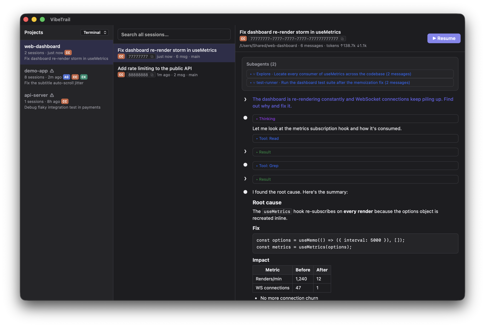
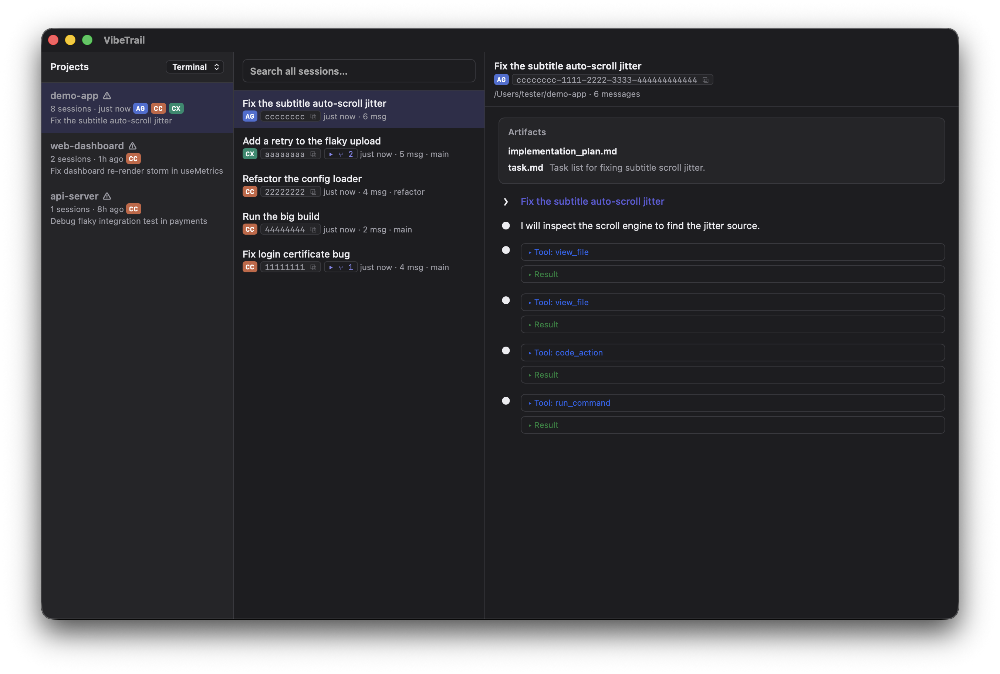

<p align="center">
  
</p>

<h1 align="center">VibeTrail</h1>

<p align="center"><b>Session browser &amp; resume for coding agents — Claude Code, Codex, Antigravity, and yours next.</b></p>

<p align="center">
  <a href="https://github.com/vibetrail/vibetrail/actions"></a>
  
  
  
</p>

Browse and search every coding-agent session you have ever run — across all
projects and all agents — and jump back into any of them with one click.

<p align="center">
  
</p>

> **Unofficial.** VibeTrail is an independent open-source project. It is not
> affiliated with, endorsed by, or sponsored by Anthropic, OpenAI, Google, or
> any other agent vendor. It only reads the session files those tools already
> store on your machine, strictly read-only.

## Why

Coding agents scatter session history across private local directories and
formats. Their built-in resume pickers show only a handful of recent sessions,
there is no cross-project view, no cross-agent view, and no way to answer
"which session did I fix that nginx config in three weeks ago?". VibeTrail
closes the loop: **browse → search → resume**.

- **One inbox for every agent.** A provider abstraction unifies session
  history behind a single UI and CLI.
- **Lightweight by design.** No database, no index, no background process, no
  file watcher. Files are read live; search links the ripgrep engine crates
  directly.
- **Two entry points.** A macOS app (Tauri) and a `vibetrail` CLI (JSON
  output for scripting).

## Features

- **Project overview** — every project you've ever run an agent in, across
  all providers, grouped by working directory. Orphaned paths are flagged.
- **Session browsing** — infinite-scroll session lists with copyable session
  ids; resume/fork chains (continued sessions, Codex forks, multi-agent
  worker threads) fold under their root session.
- **Timeline** — markdown-rendered conversation, collapsed tool call /
  result / thinking blocks, token totals, subagent trees, Antigravity
  artifacts. Long tool outputs preview at 2000 chars with full text on
  demand.
- **Search** — full-text across every provider and project (ripgrep engine
  linked in, no external binary), project scoping, jump-to-message anchors;
  results stay open while you browse hits.
- **Resume** — one click reopens the session in Terminal.app, iTerm2,
  Ghostty, or Warp, in the right directory, with the right agent command.
- **Scriptable** — every query command takes `--json` with a stable,
  snapshot-tested schema.

<p align="center">
  
</p>

## Status

| Provider | Status | Capabilities |
|----------|--------|--------------|
| Claude Code | ✅ | browse / search / resume, subagent view, token stats |
| Codex | ✅ | browse / search / resume, incl. `.jsonl.zst` |
| Antigravity | ✅ experimental | browse / search / artifacts (no resume) |

## Requirements

- macOS 14+ (primary target; the core and CLI are portable Rust)
- Rust toolchain (to build from source)

## Build

```sh
# CLI
cargo build --release -p vibetrail-cli
target/release/vibetrail --help

# GUI (Tauri v2)
cargo run --release -p vibetrail-app
```

Search is built in (the ripgrep engine crates are linked directly) — no
external `rg` binary required.

## CLI

```sh
vibetrail projects                      # every project, across all agents
vibetrail sessions <project> [-n 20]    # sessions of one project, newest first
vibetrail search "race condition"       # full-text search, grouped by session
vibetrail show <session-id>             # outline view (--full for transcript)
vibetrail resume <session-id>           # cd to the project and exec the agent's resume
vibetrail open [<project>]              # launch the GUI
```

Every query command accepts `--json`. Session ids accept any unique prefix.

Exit codes: `0` success · `1` usage error · `2` data error · `3` resume
precondition failed · `4` operation unsupported by provider.

## Configuration

The GUI's Resume button can target Terminal.app (default), iTerm2, Ghostty, or
Warp — pick one in the sidebar selector (stored in
`~/.config/vibetrail/config.json`).

- **Terminal.app / iTerm2** — fully automatic (AppleScript).
- **Ghostty** — cold start is fully automatic; with Ghostty already running,
  VibeTrail opens a new tab in the project directory through Ghostty's own
  Finder service and puts the resume command on your clipboard (its scripting
  API is still a preview — VibeTrail deliberately avoids driving it).
- **Warp** — opens the project window; the resume command lands on your
  clipboard (Warp has no scriptable command execution).

## Safety

- Agent storage directories (`~/.claude`, `~/.codex`, `~/.gemini`, …) are
  opened strictly read-only.
- Resume validates that the project path still exists before launching
  anything.
- The GUI's resume uses macOS Automation (osascript → Terminal); you will be
  asked for permission on first use.

## Development

```sh
cargo test --workspace                                  # fixture parity tests + --json snapshots
cargo clippy --workspace --all-targets -- -D warnings   # CI runs this
cargo fmt --all --check
```

Architecture, ADRs, provider protocol, and per-provider format notes live in
[`TECH_SPEC.md`](TECH_SPEC.md); requirements in [`PRD.md`](PRD.md); release
notes in [`CHANGELOG.md`](CHANGELOG.md).

## Contributing

Provider implementations are self-contained under
`crates/vibetrail-core/src/providers/`. New providers are welcome — the bar is
that all capabilities must work by reading files only (no host process, no
reverse-engineered binary formats). See [`CONTRIBUTING.md`](CONTRIBUTING.md)
for the provider implementation guide and workflow rules.

## License

[Apache-2.0](LICENSE)
